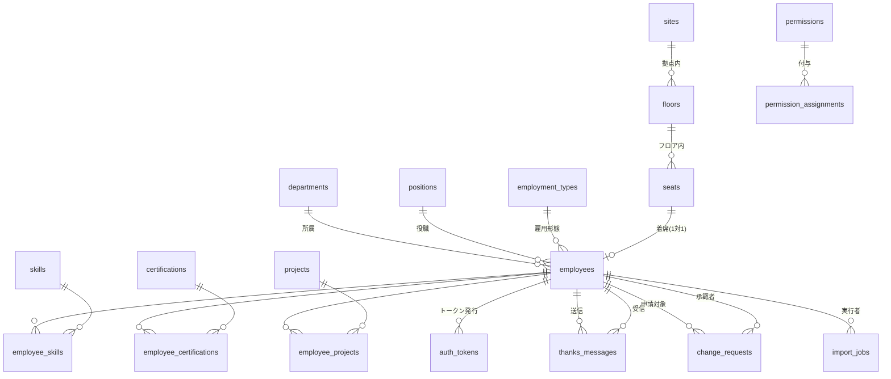

# フロンティア社員情報管理システム DB設計書

- チーム名: チームA
- 作成者: 浅野（API設計・DB設計担当）
- DBMS: PostgreSQL 16

本書は [API設計仕様書.md](API設計仕様書.md) に対応するテーブル設計を定義する。

---

## 設計方針

| 項目 | 方針 |
| --- | --- |
| 命名規則 | すべて snake_case。テーブル名は複数形（`employees`）、主キーは `<単数形>_id`（`employee_id`） |
| 主キー | `BIGSERIAL`（自動採番）。中間テーブルのみ複合主キー |
| 文字コード | UTF-8（`UTF8`）、照合順序は `ja-x-icu` |
| 日時型 | `TIMESTAMPTZ`（タイムゾーン付き）。アプリ側では JST として扱う |
| 日付型 | `DATE`（時刻を持たない項目） |
| 共通カラム | 全テーブルに `created_at` / `updated_at` を持たせる（中間テーブル・ログ系を除く） |
| 削除方針 | **社員のみ論理削除**（`status = 0`）。マスタは物理削除だが、参照中は外部キー制約で拒否される |
| 外部キー | 原則 `ON DELETE RESTRICT`。参照が残っている親は消せない（API の CONFLICT(409) に対応） |
| 真偽値 | `BOOLEAN` を使う。区分値は `SMALLINT`（API設計仕様書の「共通の値定義」に準拠） |

---

## ER図

**テーブル数: 19**

| 分類 | テーブル |
| --- | --- |
| 社員（1） | `employees` |
| マスタ（9） | `departments` `positions` `sites` `floors` `seats` `employment_types` `skills` `certifications` `projects` |
| 中間（3） | `employee_skills` `employee_certifications` `employee_projects` |
| 認証（1） | `auth_tokens` |
| 機能（4） | `thanks_messages` `change_requests` `import_jobs` |
| 権限（2） | `permissions` `permission_assignments` |

---

## 1. employees（社員）

システムの中心となるテーブル。API設計仕様書の 2〜6章に対応。

| カラム | 型 | NULL | 既定値 | 説明 |
| --- | --- | --- | --- | --- |
| `employee_id` | BIGSERIAL | × | 自動採番 | 主キー |
| `employee_code` | VARCHAR(20) | × | | 社員番号（例 `EMP00123`）。アカウント作成時の本人確認に使う。UNIQUE |
| `name` | VARCHAR(100) | × | | 氏名 |
| `name_kana` | VARCHAR(100) | ○ | | 氏名カナ。かな検索用 |
| `email` | VARCHAR(255) | × | | メールアドレス。**ログインID**。UNIQUE。ADMINが社員登録時に設定する。**機密項目**（本人・ADMINのみ閲覧可） |
| `tel` | VARCHAR(20) | ○ | | 電話番号。**機密項目** |
| `password_hash` | VARCHAR(255) | ○ | | BCrypt ハッシュ。アカウント未作成の間は NULL |
| `image_url` | VARCHAR(500) | ○ | | 顔写真URL。API 5.2 のアップロードでサーバが払い出す |
| `hobby` | VARCHAR(255) | ○ | | 趣味。本人が編集可 |
| `self_pr` | TEXT | ○ | | 自己PR。本人が編集可 |
| `hire_date` | DATE | × | | 入社日 |
| `department_id` | BIGINT | × | | → `departments` |
| `position_id` | BIGINT | ○ | | → `positions` |
| `employment_type_id` | BIGINT | × | | → `employment_types` |
| `seat_id` | BIGINT | ○ | | → `seats`。**UNIQUE**（1座席に1人まで） |
| `status` | SMALLINT | × | 1 | 0:退職・無効（論理削除） / 1:在籍 |
| `role` | VARCHAR(20) | × | 'EMPLOYEE' | `EMPLOYEE` / `ADMIN` |
| `created_at` | TIMESTAMPTZ | × | now() | |
| `updated_at` | TIMESTAMPTZ | × | now() | |

**制約**

- UNIQUE: `employee_code`, `email`, `seat_id`
- CHECK: `status IN (0, 1)` / `role IN ('EMPLOYEE', 'ADMIN')`
- FK: `department_id`, `position_id`, `employment_type_id`, `seat_id`（すべて `ON DELETE RESTRICT`）

**インデックス**

| 対象 | 理由 |
| --- | --- |
| `department_id` | 部署での絞り込み（API 2.1） |
| `position_id` | 役職での絞り込み |
| `status` | 在籍者のみの検索が既定のため、ほぼ全クエリで使う |
| `name`, `name_kana` | キーワード検索。部分一致には `pg_trgm` の GIN インデックスを検討 |

**補足**

- `seat_id` を employees 側に持たせ UNIQUE を張ることで、**座席の二重割当をDB制約で防ぐ**（API 6.1 / 6.2 の CONFLICT(409)）。
- 論理削除（API 6.3）は `status = 0` に更新し、あわせて `seat_id` を NULL にする。座席を空けるため。

---

## 2. マスタテーブル

### 2.1 departments（部署）

| カラム | 型 | NULL | 説明 |
| --- | --- | --- | --- |
| `department_id` | BIGSERIAL | × | 主キー |
| `department_name` | VARCHAR(100) | × | 部署名。UNIQUE |
| `created_at` / `updated_at` | TIMESTAMPTZ | × | |

### 2.2 positions（役職）

| カラム | 型 | NULL | 説明 |
| --- | --- | --- | --- |
| `position_id` | BIGSERIAL | × | 主キー |
| `position_name` | VARCHAR(100) | × | 役職名（部長、課長、主任 など）。UNIQUE |
| `rank` | SMALLINT | ○ | 序列。並べ替え用（小さいほど上位） |
| `created_at` / `updated_at` | TIMESTAMPTZ | × | |

### 2.3 sites（拠点）

| カラム | 型 | NULL | 説明 |
| --- | --- | --- | --- |
| `site_id` | BIGSERIAL | × | 主キー |
| `site_name` | VARCHAR(100) | × | 拠点名（本社、技術センター など）。UNIQUE |
| `address` | VARCHAR(255) | ○ | 住所 |
| `created_at` / `updated_at` | TIMESTAMPTZ | × | |

### 2.4 floors（フロア）

| カラム | 型 | NULL | 説明 |
| --- | --- | --- | --- |
| `floor_id` | BIGSERIAL | × | 主キー |
| `site_id` | BIGINT | × | → `sites` |
| `floor_name` | VARCHAR(50) | × | 表示名（例 `3階`） |
| `floor_number` | SMALLINT | × | 階数。並べ替え用。地下は負数 |
| `map_image_url` | VARCHAR(500) | ○ | フロアマップ画像のURL |
| `created_at` / `updated_at` | TIMESTAMPTZ | × | |

**制約**: UNIQUE(`site_id`, `floor_number`) — 同一拠点に同じ階は作れない

### 2.5 seats（座席）

| カラム | 型 | NULL | 説明 |
| --- | --- | --- | --- |
| `seat_id` | BIGSERIAL | × | 主キー |
| `floor_id` | BIGINT | × | → `floors` |
| `seat_number` | VARCHAR(50) | × | 座席番号（例 `3F-A12`） |
| `position_x` | INTEGER | × | マップ画像上のX座標（px） |
| `position_y` | INTEGER | × | マップ画像上のY座標（px） |
| `created_at` / `updated_at` | TIMESTAMPTZ | × | |

**制約**: UNIQUE(`floor_id`, `seat_number`)

> 空席かどうかは `employees.seat_id` を参照して判定する（seats 側に在席フラグは持たない）。二重管理を避けるため。

### 2.6 employment_types（雇用形態）

| カラム | 型 | NULL | 説明 |
| --- | --- | --- | --- |
| `employment_type_id` | BIGSERIAL | × | 主キー |
| `employment_type_name` | VARCHAR(50) | × | 正社員、契約社員、派遣 など。UNIQUE |
| `created_at` / `updated_at` | TIMESTAMPTZ | × | |

### 2.7 skills（スキルマスタ）

| カラム | 型 | NULL | 説明 |
| --- | --- | --- | --- |
| `skill_id` | BIGSERIAL | × | 主キー |
| `skill_name` | VARCHAR(100) | × | スキル名（Java、React など）。UNIQUE |
| `category` | VARCHAR(50) | ○ | 分類（言語、フレームワーク、DB など） |
| `created_at` / `updated_at` | TIMESTAMPTZ | × | |

### 2.8 certifications（資格マスタ）

| カラム | 型 | NULL | 説明 |
| --- | --- | --- | --- |
| `certification_id` | BIGSERIAL | × | 主キー |
| `certification_name` | VARCHAR(150) | × | 資格名。UNIQUE |
| `created_at` / `updated_at` | TIMESTAMPTZ | × | |

### 2.9 projects（プロジェクトマスタ）

| カラム | 型 | NULL | 説明 |
| --- | --- | --- | --- |
| `project_id` | BIGSERIAL | × | 主キー |
| `project_name` | VARCHAR(200) | × | プロジェクト名 |
| `start_date` | DATE | ○ | 開始日 |
| `end_date` | DATE | ○ | 終了日。継続中は NULL |
| `description` | TEXT | ○ | 概要 |
| `created_at` / `updated_at` | TIMESTAMPTZ | × | |

**制約**: CHECK(`end_date` IS NULL OR `start_date` <= `end_date`)

---

## 3. 中間テーブル

### 3.1 employee_skills（社員↔スキル）

| カラム | 型 | NULL | 説明 |
| --- | --- | --- | --- |
| `employee_id` | BIGINT | × | → `employees`。複合主キー |
| `skill_id` | BIGINT | × | → `skills`。複合主キー |
| `proficiency` | SMALLINT | × | 1:初級 / 2:中級 / 3:上級 |
| `experience_years` | NUMERIC(4,1) | ○ | 経験年数（例 `5.5`）。最大 999.9 |
| `created_at` / `updated_at` | TIMESTAMPTZ | × | |

**制約**
- PK(`employee_id`, `skill_id`) — **同一スキルの重複登録をDBで防ぐ**（API 6.4 の CONFLICT(409)）
- CHECK: `proficiency BETWEEN 1 AND 3`
- CHECK: `experience_years >= 0`
- インデックス: `skill_id`（スキルからの逆引き検索。API 2.1 の `skill_id` 検索で使う）

### 3.2 employee_certifications（社員↔資格）

| カラム | 型 | NULL | 説明 |
| --- | --- | --- | --- |
| `employee_id` | BIGINT | × | → `employees`。複合主キー |
| `certification_id` | BIGINT | × | → `certifications`。複合主キー |
| `acquire_date` | DATE | × | 取得日 |
| `created_at` / `updated_at` | TIMESTAMPTZ | × | |

**制約**: PK(`employee_id`, `certification_id`)、インデックス `certification_id`

### 3.3 employee_projects（社員↔プロジェクト）

| カラム | 型 | NULL | 説明 |
| --- | --- | --- | --- |
| `employee_id` | BIGINT | × | → `employees`。複合主キー |
| `project_id` | BIGINT | × | → `projects`。複合主キー |
| `role_in_project` | VARCHAR(100) | ○ | 担当役割（フロントエンド担当 など） |
| `start_date` | DATE | ○ | 参画日 |
| `end_date` | DATE | ○ | 離任日。継続中は NULL |
| `created_at` / `updated_at` | TIMESTAMPTZ | × | |

**制約**: PK(`employee_id`, `project_id`)、CHECK(`end_date` IS NULL OR `start_date` <= `end_date`)、インデックス `project_id`

---

## 4. auth_tokens（認証トークン）

API設計仕様書の「認証トークンの仕様」に対応。**opaque token 方式**のため、発行したトークンをここで管理する。

| カラム | 型 | NULL | 既定値 | 説明 |
| --- | --- | --- | --- | --- |
| `token_id` | BIGSERIAL | × | 自動採番 | 主キー |
| `token_hash` | VARCHAR(64) | × | | トークンの SHA-256 ハッシュ（16進64文字）。UNIQUE |
| `employee_id` | BIGINT | × | | → `employees` |
| `token_type` | VARCHAR(10) | × | | `ACCESS` / `REFRESH` |
| `expires_at` | TIMESTAMPTZ | × | | 有効期限（ACCESS:1時間後 / REFRESH:14日後） |
| `revoked_at` | TIMESTAMPTZ | ○ | NULL | 失効日時。NULL なら有効 |
| `parent_token_id` | BIGINT | ○ | | ACCESS の場合、発行元の REFRESH トークン。ログアウト時の連鎖失効に使う |
| `created_at` | TIMESTAMPTZ | × | now() | |

**制約**
- UNIQUE: `token_hash`
- CHECK: `token_type IN ('ACCESS', 'REFRESH')`
- FK: `employee_id`（`ON DELETE CASCADE` — 社員が物理削除された場合はトークンも消す）
- インデックス: `token_hash`（**毎リクエストで検索するため必須**）、`employee_id`、`expires_at`

**運用**

- **平文のトークンは保存しない。** ハッシュ値のみを保存し、照合時はリクエストのトークンをハッシュ化して検索する。DBが漏れてもなりすまされないようにするため
- 期限切れレコードは定期的に物理削除する（バッチ、または起動時のクリーンアップ）
- 有効性の判定条件: `revoked_at IS NULL AND expires_at > now()`

---

## 5. thanks_messages（サンクスメッセージ）

| カラム | 型 | NULL | 既定値 | 説明 |
| --- | --- | --- | --- | --- |
| `message_id` | BIGSERIAL | × | 自動採番 | 主キー |
| `from_employee_id` | BIGINT | × | | 送信者 → `employees` |
| `to_employee_id` | BIGINT | × | | 受信者 → `employees` |
| `body` | VARCHAR(300) | × | | 本文（1〜300文字） |
| `sent_at` | TIMESTAMPTZ | × | now() | 送信日時 |

**制約**
- CHECK: `from_employee_id <> to_employee_id` — **自分宛て送信をDBで防ぐ**（API 8.1）
- CHECK: `length(body) BETWEEN 1 AND 300`
- インデックス: `sent_at DESC`（タイムラインは新着順固定のため）、`from_employee_id`、`to_employee_id`

> メッセージは編集・削除しない想定のため `updated_at` を持たない。

---

## 6. change_requests（基本情報変更申請）

| カラム | 型 | NULL | 既定値 | 説明 |
| --- | --- | --- | --- | --- |
| `request_id` | BIGSERIAL | × | 自動採番 | 主キー |
| `target_employee_id` | BIGINT | × | | 申請対象（＝申請者本人） → `employees` |
| `target_field` | VARCHAR(50) | × | | 変更対象のカラム名（例 `department_id`） |
| `before_value` | VARCHAR(255) | ○ | | 変更前の値。**申請時にサーバが現在値を取得して記録** |
| `after_value` | VARCHAR(255) | × | | 変更後の希望値 |
| `reason` | VARCHAR(500) | ○ | | 申請理由 |
| `status` | SMALLINT | × | 0 | 0:申請中 / 1:承認 / 2:却下 |
| `requested_at` | TIMESTAMPTZ | × | now() | 申請日時 |
| `reviewed_by` | BIGINT | ○ | | 承認・却下したADMIN → `employees` |
| `reviewed_at` | TIMESTAMPTZ | ○ | | 処理日時 |
| `review_comment` | VARCHAR(500) | ○ | | 承認・却下のコメント |

**制約**
- CHECK: `status IN (0, 1, 2)`
- 部分UNIQUE: `UNIQUE (target_employee_id, target_field) WHERE status = 0`
  同じ社員・同じ項目で**申請中のものは1件まで**（API 9.1 の CONFLICT(409)）。処理済みは何件でも残せる
- インデックス: `status`、`target_employee_id`

---

## 7. import_jobs（一括インポートジョブ）

| カラム | 型 | NULL | 説明 |
| --- | --- | --- | --- |
| `job_id` | VARCHAR(50) | × | 主キー。`imp_20260727_001` 形式 |
| `executed_by` | BIGINT | × | 実行したADMIN → `employees` |
| `file_name` | VARCHAR(255) | ○ | アップロードされたファイル名 |
| `status` | VARCHAR(20) | × | `processing` / `completed` / `failed` |
| `total_rows` | INTEGER | ○ | 総行数 |
| `success_rows` | INTEGER | ○ | 成功行数 |
| `error_rows` | INTEGER | ○ | エラー行数 |
| `errors` | JSONB | ○ | エラー詳細。`[{"row":34,"reason":"..."}]` |
| `started_at` | TIMESTAMPTZ | × | 開始日時 |
| `finished_at` | TIMESTAMPTZ | ○ | 完了日時 |

**制約**: CHECK `status IN ('processing','completed','failed')`

> エラー詳細は件数・構造が可変なので `JSONB` を採用。専用テーブルに分ける必要が出たら分離する。

---

## 8. 権限テーブル

### 8.1 permissions（権限マスタ）

| カラム | 型 | NULL | 説明 |
| --- | --- | --- | --- |
| `permission_id` | BIGSERIAL | × | 主キー |
| `permission_code` | VARCHAR(50) | × | 権限コード（`VIEW` など）。UNIQUE |
| `permission_name` | VARCHAR(100) | × | 表示名（閲覧可能 など） |
| `created_at` / `updated_at` | TIMESTAMPTZ | × | |

### 8.2 permission_assignments（権限付与）

| カラム | 型 | NULL | 説明 |
| --- | --- | --- | --- |
| `assignment_id` | BIGSERIAL | × | 主キー |
| `permission_id` | BIGINT | × | → `permissions` |
| `target_type` | VARCHAR(20) | × | 付与先の種別。`DEPT` / `POSITION` / `EMPLOYEE` |
| `target_id` | BIGINT | × | 付与先のID。`target_type` によって参照先が変わる |
| `created_at` | TIMESTAMPTZ | × | |

**制約**
- UNIQUE(`permission_id`, `target_type`, `target_id`)
- CHECK: `target_type IN ('DEPT','POSITION','EMPLOYEE')`

> `target_id` は `target_type` によって参照先テーブルが変わるため、**外部キー制約を張れない**（ポリモーフィック関連）。整合性はアプリ側で担保する。
> 権限が「部署単位」だけで足りるなら、`permission_assignments` に `department_id` の外部キーを直接持たせる設計に単純化できる。要検討。

---

## API設計仕様書との対応

| API | 主に使うテーブル |
| --- | --- |
| 1. 認証 | `employees`, `auth_tokens` |
| 2. 社員検索 | `employees` + 全マスタ + 中間テーブル3つ |
| 3. 社員詳細 | 同上 |
| 4. フロアマップ | `sites`, `floors`, `seats`, `employees` |
| 5. 自己PR編集 | `employees` |
| 6. 社員CRUD | `employees`, 中間テーブル3つ |
| 7. マスタ管理 | 各マスタ |
| 8. サンクスメッセージ | `thanks_messages`, `employees` |
| 9. 変更申請 | `change_requests`, `employees` |
| 10. インポート/エクスポート | `import_jobs`, `employees` |

---

## 決定事項

| No | 内容 | 決定 |
| --- | --- | --- |
| 1 | **ログインID** | **メールアドレス（`email`）**。`employee_code` はアカウント作成時の本人確認にのみ使う |
| 2 | **email の登録者** | **ADMIN** が社員登録（API 6.1）時に設定する。本人はアカウント作成（API 1.4）時に照合のため送信するだけで、新規に決めることはできない。そのため `employees.email` は **NOT NULL** |

---

## 未確定事項（チームで要確認）

| No | 内容 | 論点 |
| --- | --- | --- |
| 1 | `name_kana` の追加 | かな検索のために追加した。API設計仕様書には未記載なので、使うなら仕様書側にも追記が必要 |
| 2 | 権限テーブルの要否 | `employees.role`（EMPLOYEE/ADMIN）だけで要件を満たせる可能性がある。`permissions` / `permission_assignments` は前期のスコープでは使わないかもしれない |
| 3 | `import_jobs.errors` の JSONB | 別テーブルに分けるかどうか。今の要件なら JSONB で十分 |
| 4 | 検索の部分一致 | `keyword` 検索を LIKE で済ませるか、`pg_trgm` 拡張を入れるか。800名程度なら LIKE で足りる見込み |
